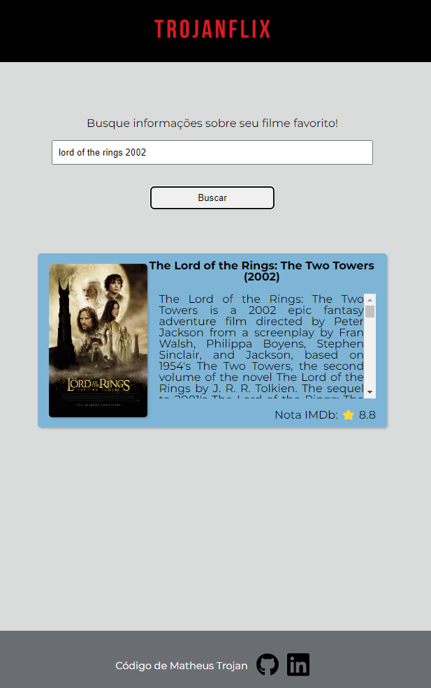

# TrojanFlix

Um aplicativo para buscar informações sobre o seu filme favorito!

## Conteúdo deste Readme:

- [Resumo](#resumo)
  - [O Desafio](#o-desafio)
  - [Screenshot](#screenshot)
  - [Preview](#preview)
  - [Links](#links)
- [Meu processo](#meu-processo)
  - [Projetado com](#projetado-com)
  - [O que eu aprendi](#o-que-eu-aprendi)
- [Autor](#autor)

## Resumo

### O Desafio

O objetivo aplicativo é ser intuitivo e de fácil utilização. Com layout simples, o usuário preenche os dados de login e é levado para uma segunda página, onde pode pesquisar pelo nome do filme desejado para obter informações como sinopse, ano de lançamento e nota no imDB.

O usuário deverá conseguir:

- Preencher os campos do formuláriode login;
- Ser enviado para a segunda página;
- Conseguir pesquisar o filme desejado;
- Obter as informações do filme escolhido;

### Screenshot

### Preview

### Links

- Deploy: [Veja o resultado](https://trojan-flix.vercel.app/)

## Meu processo

### Projetado com

- HTML5 semântico
- Propriedades CSS
- Flexbox
- Funções JavaScript

### O que eu aprendi

🟢 Validar formulário de login simples  
🟢 Buscar na API do imDB as informações do filme e mostrar na tela

## Autor

- [LinkedIn](https://www.linkedin.com/in/matheus-trojan/)
